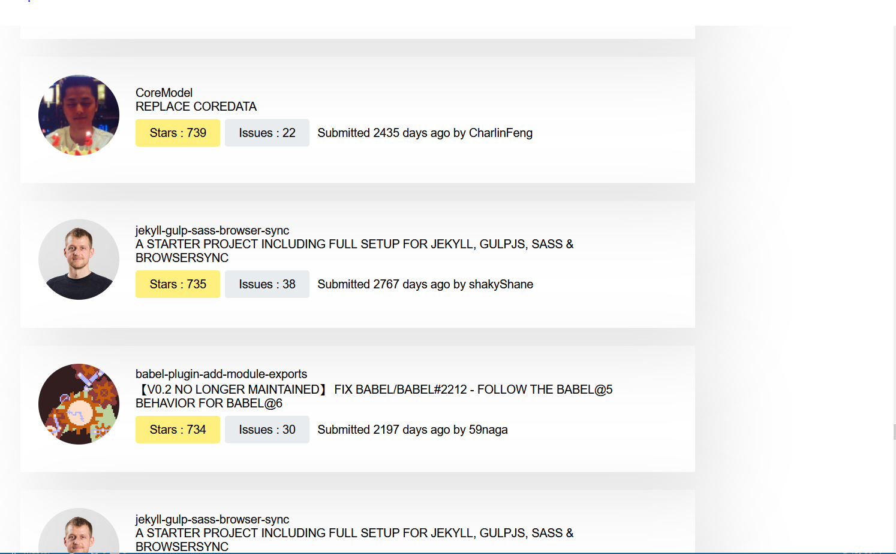
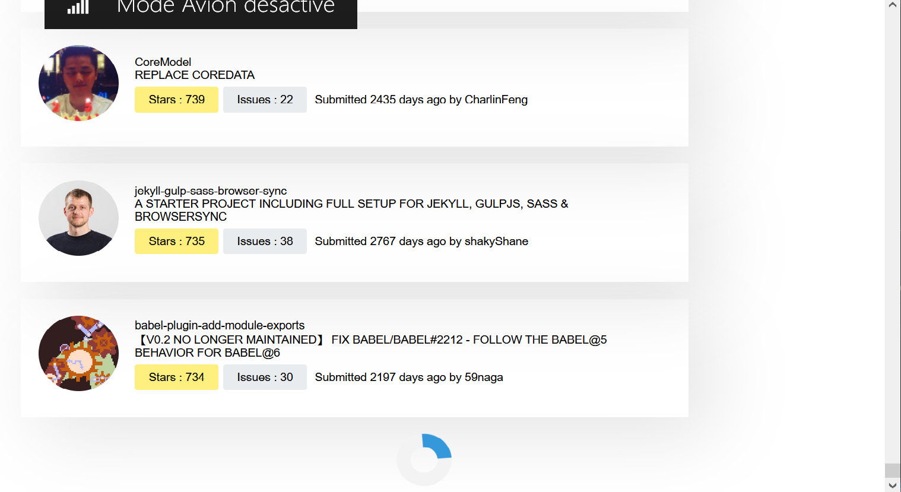

# Front-end Coding Challenge

## Getting started
* To install dependencies:
`yarn install`

* To run webpack dev server:
`yarn start`

* Navigate to [localhost:3000](http://localhost:3000/) in browser to view page

## Technologies used
* HTML 
* CSS 
* React
* axios

## Idea of the App 
The main idea is to implement a small webapp that will list the most starred Github repos that were created in the last 30 days. 
You'll be fetching the sorted JSON data directly from the Github API (Github API explained down below). 

## Features
* As a User I should be able to list the most starred Github repos that were created in the last 30 days. 
* As a User I should see the results as a list. One repository per row. 
* As a User I should be able to see for each repo/row the following details :
  * Repository name
  * Repository description 
  * Number of stars for the repo. 
  * Number of issues for the repo.
  * Username and avatar of the owner. 
* As a User I should be able to keep scrolling and new results should appear (pagination).

## Mockups

## Implementation

